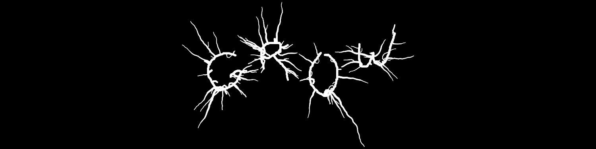
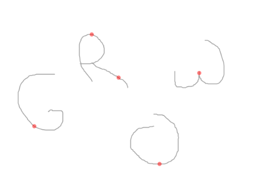
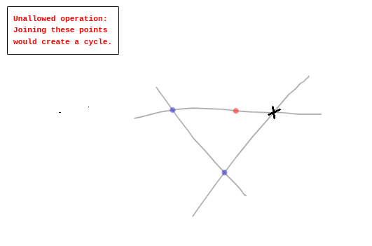

# The GROW-Project

With this project I'm realizing an idea that was stuck in my head for some time: An algorithm, that simulates tree like growing patterns along any drawn strokes. The inspiration for this came from metal band logos like the one of the french group Gojira. To make my tool easy to use and available for anyone, I created a frontend and published it on: [**grow.tillli.us**](http://grow.tillli.us) 

Enjoy! :-)

## How it works

#### Traces, Strokes and Structs

The frontend enables users to draw any shape on a simple canvas. Therefore it utilizes a modified Version of the [handwriting.js library by ChenYuHo](https://github.com/ChenYuHo/handwriting.js) that binds to a standard html canvas and registers all **traces** drawn on it. Before these traces are converted to **structs** that will later enable an iterative grow process, I added some pre-processing steps, converting said **traces** to **strokes**.
First I changed the data format from two arrays containing x and y coordinates to an array of tuples, that contain the corresponding x and y coordinates: 
*[[x1, x2, .., xn], [y1, y2, .., yn]]*    ->    *[[x1, y1], [x2, y2], .., [xn, yn]]*
The next processing step adds extra points in between two points that are far apart from each other. Such far distant points appear, when a "straight" line is drawn on the canvas. As my algorithm creates nodes from each point, and allows new sprouting to appear from these nodes, a stroke between two far apart points wouldn't be able to branch and therefore would lead to a more uneven sprouting.
To be able to control, from which point on the stroke the growing process starts, I added an array of starting points, that holds the index of a coordinate tuple for each stroke as starting point. These starting points can be observed and changed in the Edit Mode. Here they are marked as red dots.

I've also added Join Points, they are used to combine to strokes, so they later behave as one connected structure. Every structure can only have one start point whether they consist of multiple strokes or not. They can be added and removed in the edit mode and are resembled by blue dots. Also cyclic joins aren't allowed. The program informs the user with an error popup, if they try to create such cyclic join. Internally the join points have the following structure.
*{strokeA, pointAIndex, strokeB, pointBIndex, intersection}*
Where *strokeA* and *strokeB* are the indices of the corresponding strokes in the state.strokeState.strokes Array, the *pointAIndex* and *pointBIndex* are the indices of the corresponding Nodes in the strokes and the *intersection* variable holds the concrete coordinates of this point.
From the processed strokes and the start- and join-points and a tree config object, the programm then constructs structures when the grow process is started. 

## Startup im Dev-Mode

#### Installation of dependencies

```shell
npm install
```

#### HTML-Startup

```shell
php -S localhost:8000 -t public
```

#### SCSS-Startup

```shell
npm run sass
```
